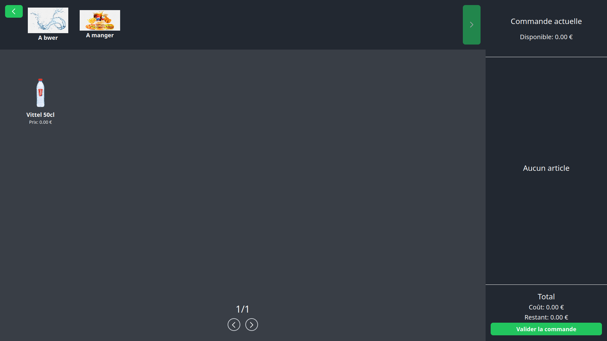

<p align="center">
  <p align="center">
    <a href="https://github.com/CETEN-OpenBar/bar/releases/latest"></a>
    <a href="/LICENSE"></a>
    <a href="https://codeclimate.com/github/CETEN-OpenBar/bar/test_coverage"></a>
    <a href="https://codeclimate.com/github/CETEN-OpenBar/bar/maintainability"></a>
    <a href="https://goreportcard.com/report/github.com/CETEN-OpenBar/bar/backend"></a>
    <a href="https://godoc.org/github.com/CETEN-OpenBar/bar/backend"></a>
  </p>
</p>

# Le Bar

**Le Bar** is a monorepository containing both the frontend and backend components of a system designed to manage various aspects of a bar's operations. This document provides an overview of the project structure, setup instructions, and available commands.

## Presentation



## Dependencies

Before you begin, ensure you have the following dependencies installed:

- **Go:** The Go programming language is required to build and run the backend. You can download and install Go from the [official website](https://golang.org/).

- **Node.js:** Node.js is required to build and run the frontend. Download and install Node.js from the [official website](https://nodejs.org/).

- **Go-Task (task):** Task is a simple task runner for Go projects. It's used in this project for automating setup and regeneration tasks. You can install Task by following the instructions on the [GitHub repository](https://github.com/go-task/task).

## Project Structure

The repository is organized into the following components:

- **backend:** This folder contains the backend implementation of the application.
- **frontend:** This folder encompasses the entire frontend of the application, including terminal, admin panels & public interface.
- **bar.openapi.yml:** The OpenAPI specification for the project.
- **docker-compose.yml:** A configuration file for Docker Compose, enabling easy deployment of the MongoDB database and Mongo Express.
- **backend/Taskfile.yml and frontend/Taskfile.yml:** Contains tasks for setting up dependencies and regenerating API files using OpenAPI specifications.

## Configuration

- **Backend Configuration:**
  - Copy the `.env.example` file located at `backend/.env.example` to `backend/.env` in the development environment. Adjust the values in `.env` as needed for your setup.

  - **Google OAuth Configuration:**
    - To enable Google OAuth, you need to create a Google Cloud project and obtain OAuth client credentials.
    - Follow these steps to create and configure the Google project:
      1. Go to the [Google Cloud Console](https://console.cloud.google.com/).
      2. Create a new project.
      3. In the project dashboard, navigate to "APIs & Services" > "Credentials."
      4. Create OAuth client credentials. Choose "Web application" as the application type.
      5. Set the authorized redirect URIs to match your backend URI (e.g., `http://localhost:8080/auth/google/callback`).
      6. Once created, copy the Client ID and Client Secret.
    - Update the following environment variables in `backend/.env` with the obtained credentials:
      ```
      BAR_OAUTH_GOOGLE_CLIENT_ID=YOUR_CLIENT_ID
      BAR_OAUTH_GOOGLE_CLIENT_SECRET=YOUR_CLIENT_SECRET
      ```

- **Frontend Configuration:**
  - Copy the `frontend/static/config.dev.json` file to `frontend/static/config.json` in the development environment. Modify the settings in `config.json` to match your preferences.

## Setup

To get the project up and running, follow these steps:

1. **Start Database:**
   - Run the following command to initiate the MongoDB database and Mongo Express UI:
     ```
     docker compose up -d
     ```

2. **Backend Setup:**
   - Navigate to the `backend` folder.
   - Run the setup task to install backend dependencies:
     ```
     task setup
     ```

3. **Frontend Setup:**
   - Navigate to the `frontend` folder.
   - Run the setup task to install frontend dependencies:
     ```
     task setup
     ```

4. **Regenerate API Files:**
   - To regenerate API files based on OpenAPI specifications, run the following in either the `backend` or `frontend` folder, depending on which API files you need to generate (you only need to do so on bar.openapi.yml changes):
     ```
     task regen
     ```

2. **Backend:**
   - Navigate to the `backend` folder.
   - Start the backend using the following command:
     ```
     go run cmd/bar/main.go
     ```

3. **Frontend:**
   - Navigate to the `frontend` folder.
   - Start the frontend development server with:
     ```
     npm run dev
     ```

Please note that actions requiring the terminal to be "safe" require an "X-Local-Token" for route access. For such cases, ensure the frontend is redeployed on the local machine using the local token.

## Contributing

Contributions to the project are welcome. If you encounter any issues or have suggestions, please submit an issue or pull request.

## License

This project is licensed under the [MIT License](LICENSE).
